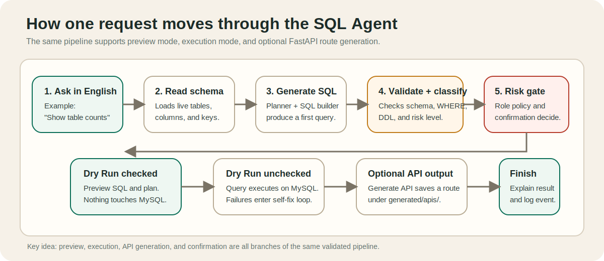
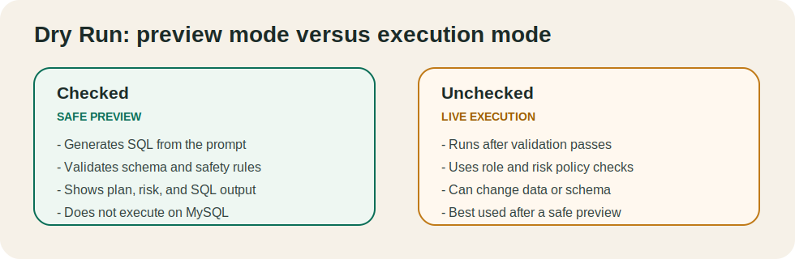
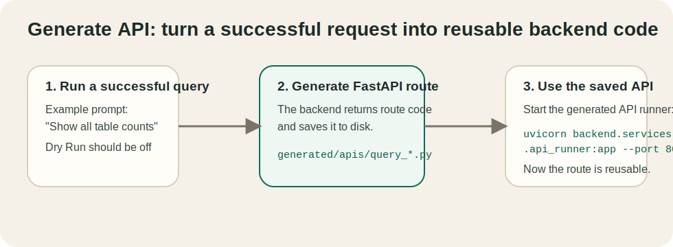
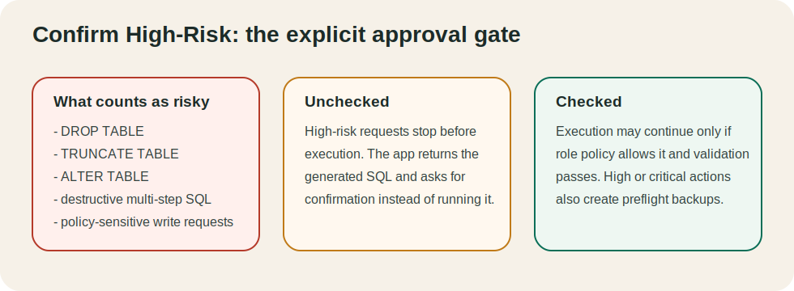

# Self-Correcting SQL Agent

Natural-language to MySQL system with validation, role checks, dry-run support, self-correction, audit logging, and optional API generation.

## Flow At A Glance



This diagram is the shortest way to understand the project:

- the app reads the live MySQL schema
- generates SQL from your prompt
- validates it and classifies risk
- either previews it, executes it, or saves generated API code
- explains the result and logs the event

## What lives where

```text
sql-agent/
├─ backend/
│  ├─ api/main.py           # FastAPI app used by the React frontend
│  ├─ core/                 # config, controller, policy, audit, risk logic
│  ├─ db/                   # MySQL connection, schema, backup helpers
│  ├─ llm/                  # SQL generation, planning, correction, explanation
│  └─ services/             # validation, API generation, generated API runner
├─ frontend/                # React + Vite app
├─ generated/apis/          # Auto-generated CRUD routers
├─ logs/                    # audit log and preflight backups
├─ Sample_db.sql            # sample database
└─ requirements.txt
```

## Prerequisites

- Python 3.11 or 3.12
- Node.js LTS
- MySQL 8.x
- Ollama running locally, or valid Groq/OpenAI credentials

## Check Prerequisites

Run these commands to confirm the required tools are installed:

```powershell
python --version
node --version
npm --version
mysql --version
ollama --version
```

If Ollama is installed but not running, start it with:

```powershell
ollama serve
```

## Database First

Before starting the app, make sure a MySQL database exists and is reachable.

### Option A: Use the sample database

1. Start the MySQL service.
2. Create the database if it does not already exist.

```powershell
mysql -u root -p -e "CREATE DATABASE IF NOT EXISTS shop_db;"
```

3. Import the sample schema and data.

```powershell
Get-Content .\Sample_db.sql | mysql -u root -p shop_db
```

4. Set `DB_NAME=shop_db` in `.env`.

Note: each `mysql -u root -p ...` command will prompt for the MySQL password because it is a separate command. If you want to enter the password only once, open a MySQL shell with `mysql -u root -p` and run the SQL inside that session.

### Option B: Use your own database

1. Create your own MySQL database.
2. Update `DB_NAME` in `.env` to match it.
3. Make sure the tables exist before asking the agent questions.

## Quick Setup

1. Create and activate a virtual environment.

```powershell
python -m venv .venv
.\.venv\Scripts\Activate.ps1
```

2. Install backend dependencies.

```powershell
pip install -r requirements.txt
```

3. Create your environment file from the example and edit it.

```powershell
Copy-Item .env.example .env
```

4. Import the sample database if you want the demo schema.

```powershell
Get-Content .\Sample_db.sql | mysql -u root -p shop_db
```

This also prompts for the MySQL password because it is a separate command. That is expected.

5. Start the backend API.

```powershell
python -m uvicorn backend.api.main:app --reload --port 8000
```

6. Start the React frontend in a second terminal.

```powershell
cd frontend
npm install
npm run dev
```

7. Open the frontend.

```text
http://localhost:5173
```

## Optional: generated API runner

If you generate CRUD APIs into `generated/apis/`, you can serve them with:

```powershell
python -m uvicorn backend.services.api_runner:app --reload --port 8001
```

## Main backend endpoints

- `GET /api/health`
- `GET /api/schema`
- `GET /api/databases`
- `POST /api/query`
- `POST /api/generate-crud`
- `GET /api/audit`

## Query controls

- `dry_run=true` previews SQL without executing it
- `confirm_high_risk=true` allows risky operations when your role permits them
- `generate_api=true` returns a generated FastAPI route for successful queries

## UI Options

These are the three main controls in the UI and API:

- `Dry Run` checked: generate SQL, validate it, classify risk, and show the execution plan, but do not run the SQL on MySQL.
- `Dry Run` unchecked: run the SQL after validation and policy checks pass.
- `Generate API` checked: also return generated FastAPI route code, or generate CRUD APIs when the request asks for them.
- `Generate API` unchecked: only handle the query itself.
- `Confirm High-Risk` checked: allow risky operations to continue when the role and safety policy permit them.
- `Confirm High-Risk` unchecked: high-risk operations are blocked before execution.

Typical combinations:

- `Dry Run` checked + others unchecked: safe preview mode.
- `Dry Run` unchecked + `Confirm High-Risk` unchecked: safe queries run, risky ones are blocked.
- `Dry Run` unchecked + `Confirm High-Risk` checked: risky queries may run if the current role is allowed.

## Visual Guide For The Three Main Controls

### 1. Dry Run



When `Dry Run` is checked, the app shows you the generated SQL, validation result, execution plan, and risk level without touching the database.

### 2. Generate API



When `Generate API` is checked and the query succeeds, the backend saves the generated route into `generated/apis/` so you can later serve it with the generated API runner.

When you start:

```powershell
python -m uvicorn backend.services.api_runner:app --reload --port 8001
```

this happens:

- the runner scans `generated/apis/`
- every file exposing a `router` object is mounted automatically
- FastAPI serves those routes on port `8001`
- `/docs` shows the generated endpoints
- `/routes` lists the mounted routes
- `/` shows a small status response so you can confirm the runner is alive

How to know the exact generated endpoint:

- open `http://127.0.0.1:8001/docs` to see the full API list and try routes interactively
- open `http://127.0.0.1:8001/routes` to see the mounted paths as JSON
- open the generated file in `generated/apis/` and look at the decorator, for example `@router.get("/tables")`
- combine that path with the runner host, for example `GET http://127.0.0.1:8001/tables`

### 3. Confirm High-Risk



When `Confirm High-Risk` is unchecked, dangerous operations stop before execution. When it is checked, the request can continue only if validation passes and the current role is allowed to perform it.

## Destructive Operations

The validator requires a `WHERE` clause for row-level `DELETE` and `UPDATE` statements.

- `DELETE FROM table WHERE ...` and `UPDATE table SET ... WHERE ...` are allowed patterns.
- `DELETE FROM table` and `UPDATE table SET ...` without `WHERE` are blocked.
- `DROP TABLE table_name` is different. It is a DDL operation, not a row delete, so it does not use `WHERE`.
- natural-language requests such as `delete table customers` are treated as schema-drop intent and normalized to `DROP TABLE customers`

To run `DROP TABLE`, all of these must be true:

- `Dry Run` is unchecked
- `Confirm High-Risk` is checked
- the active role is allowed to execute high-risk or critical operations
- DDL is permitted by configuration and policy

Important difference:

- `DELETE FROM table WHERE ...` changes rows and needs `WHERE`
- `UPDATE table SET ... WHERE ...` changes rows and needs `WHERE`
- `DROP TABLE table_name` removes the table itself, so it does not use `WHERE`

## Safety defaults

By default the project blocks:

- DDL
- multi-statement SQL
- DELETE or UPDATE without a `WHERE` clause

You can relax these in `.env` if you understand the risk.

## Sample prompts

- `Show all tables and row counts`
- `Find duplicate email addresses`
- `List the 10 most recently created records`
- `Delete from newsletter_subscribers where id = 1`
- `Truncate table campaign_drafts`
- `Delete table demo_test`

## Testing

```powershell
python -m unittest discover -s tests -p "test_*.py"
```

## Quality Benchmark

`_quality_benchmark.py` is a small local quality-check script for the backend. It sends a set of sample prompts to `http://127.0.0.1:8000/api/query`, then checks:

- whether the request succeeded
- whether the generated SQL matches the expected pattern
- whether the reported risk level matches the expected category
- how many correction attempts were needed

Run it after the backend is already running:

```powershell
python _quality_benchmark.py
```

This script is optional. It is useful for smoke testing SQL quality after changes to generation, validation, or safety logic.
